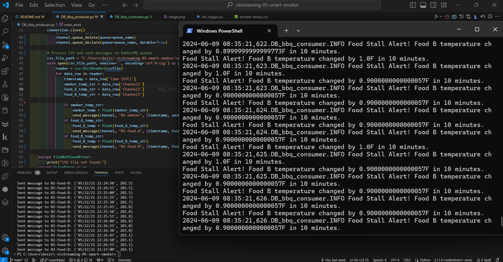
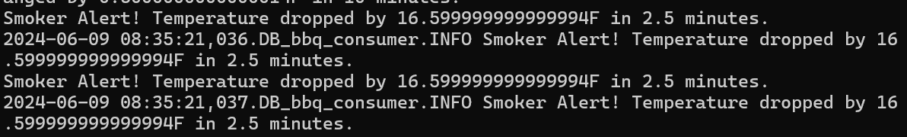
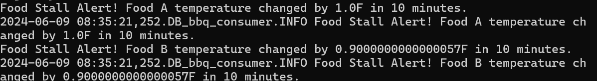

# streaming-05-smart-smoker
## Desiree Blake     June 6, 2024

###  In this Module 6, we'll add the consumers, implementing analytics based on a rolling window of time, and raise an alert when interesting events are detected. We do this by creating a system for a BBQ smoker and food items. The system has a producer script that reads the temperature data from a CSV, send it to RabbitMQ queues, and a consumer script processes the data to detect the temperature and logs alerts. 

smoker-temps.csv has 4 columns:

[0] Time = Date-time stamp for the sensor reading
[1] Channel1 = Smoker Temp --> send to message queue "01-smoker"
[2] Channe2 = Food A Temp --> send to message queue "02-food-A"
[3] Channe3 = Food B Temp --> send to message queue "02-food-B"

### We want know if:

The smoker temperature decreases by more than 15 degrees F in 2.5 minutes (smoker alert!)
Any food temperature changes less than 1 degree F in 10 minutes (food stall!)
Time Windows

Smoker time window is 2.5 minutes
Food time window is 10 minutes
Deque Max Length

At one reading every 1/2 minute, the smoker deque max length is 5 (2.5 min * 1 reading/0.5 min)
At one reading every 1/2 minute, the food deque max length is 20 (10 min * 1 reading/0.5 min) 
Condition To monitor

If smoker temp decreases by 15 F or more in 2.5 min (or 5 readings)  --> smoker alert!
If food temp change in temp is 1 F or less in 10 min (or 20 readings)  --> food stall alert!

### Requirements
RabbitMQ server running
pika installed in your active environment

### Before you Begin: 
1. Fork this starter repo into your GitHub.
2. Clone your repo down to your machine.
3. View / Command Palette - then Python: Select Interpreter
4. Select your conda environment.
5. Make sure to import pike or copy the file from a previous module

### Task 1. Create a Place to Work
1. In GitHub, create a new repo for your project - name it streaming-05-smart-smoker
2. Add a README.md during the creation process. (If not, you can always add it later.)
3. Clone your repo down to your machine. 
4. In VS Code, add a .gitignore (use one from an earlier module), start working on the README.md. Create it if you didn't earlier.
5. Add the csv data file to your repo. 
6. Create a file for your bbq producer.

### Task 2. Design and Implement Your Producer
1. Implement your bbq producer. More detailed help provided in links below. 
2. Use the logic, approach, and structure from Module 4, version 2 and version 3.
3. Use docstring comments and add your name and date to your README and your code files. 
4. Explain your project in the README. Include prerequisites and how to run your code. 
5. Document your project works - display screenshots of your console and maybe the RabbitMQ console. 
6. If you only have a producer, you won't have a consumer showing messages yet, so you'll need to be creative. We'll build the consumers next.

### Screenshots 

Visible Smoker Alert with time stamp 

Visible Food A & B stall with time stamp 

