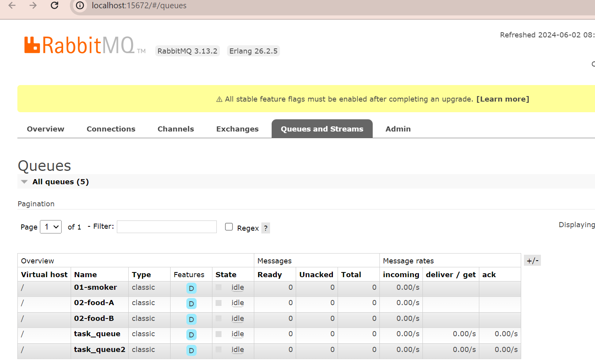

# streaming-05-smart-smoker
## Desiree Blake     May 31, 2024

### We want to stream information from a smart smoker. Read one value every half minute. (sleep_secs = 30)

smoker-temps.csv has 4 columns:

[0] Time = Date-time stamp for the sensor reading
[1] Channel1 = Smoker Temp --> send to message queue "01-smoker"
[2] Channel2 = Food A Temp --> send to message queue "02-food-A"
[3] Channel3 = Food B Temp --> send to message queue "03-food-B"
Requirements

RabbitMQ server running
pika installed in your active environment

### Before you Begin: 
1. Fork this starter repo into your GitHub.
2. Clone your repo down to your machine.
3. View / Command Palette - then Python: Select Interpreter
4. Select your conda environment.
5. Make sure to import pike or copy the file from a previous module

### Task 1. Create a Place to Work
1. In GitHub, create a new repo for your project - name it streaming-05-smart-smoker
2. Add a README.md during the creation process. (If not, you can always add it later.)
3. Clone your repo down to your machine. 
4. In VS Code, add a .gitignore (use one from an earlier module), start working on the README.md. Create it if you didn't earlier.
5. Add the csv data file to your repo. 
6. Create a file for your bbq producer.

### Task 2. Design and Implement Your Producer
1. Implement your bbq producer. More detailed help provided in links below. 
2. Use the logic, approach, and structure from Module 4, version 2 and version 3.
3. Use docstring comments and add your name and date to your README and your code files. 
4. Explain your project in the README. Include prerequisites and how to run your code. 
5. Document your project works - display screenshots of your console and maybe the RabbitMQ console. 
6. If you only have a producer, you won't have a consumer showing messages yet, so you'll need to be creative. We'll build the consumers next.

### Screenshots 

